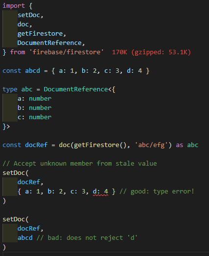

# Set 🏔️

This section discuss how sets works, we will use `setDoc` in the example, but it works the same for `batch.set` and `transaction.set`.

## Stop Unknown Member

Like update, FirelordJS stop unknown member from entering Firestore.

    

